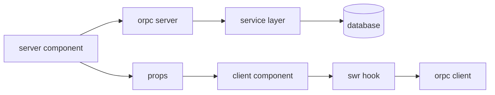

# turbokit project patterns

these patterns ensure consistency across all turbokit-generated projects while maintaining flexibility for project-specific needs.

## repository patterns

### naming convention
```
[product]-xyz       # main turborepo monorepo
[product]-apple     # ios/macos apps (separate repo)
```

### no separate repos for
- ai service (lives in apps/mastra/)
- documentation (lives in apps/docs/)
- api service (lives in apps/api/ if needed)

## data flow architecture

### unidirectional data flow


### key principles
1. **rsc fetches data** - server components call orpc directly
2. **props over fetching** - pass data as props to client components
3. **swr hydration** - use fallbackData from server
4. **services own logic** - all business logic in services
5. **orpc is thin** - only validation and delegation

## package responsibilities

### packages/auth
```typescript
// clerk wrapper with middleware
export { auth, currentUser } from '@clerk/nextjs/server'
export { authMiddleware } from './middleware'
export { ClerkProvider } from './provider'
```

### packages/database
```typescript
// single database client instance
export const db = drizzle(client, { schema })

// export schemas and types
export * from './schema'
export * from './types'

// never export client to other packages
// only services should import database
```

### packages/design
```typescript
// radix + shadcn components
export * from './components/ui'
export * from './components/features'

// tailwind v4 tokens
export * from './styles/tokens'

// component variants with cva
export { buttonVariants } from './variants'
```

### packages/orpc
```typescript
// routers mirror service domains
export * from './routers/chat'
export * from './routers/project'

// generated client
export { client } from './client'

// no business logic
// only input validation
// delegates to services
```

### packages/services
```typescript
// domain-oriented services
export { ChatService } from './chat'
export { ProjectService } from './project'

// only package that uses database
import { db } from '@repo/database'

// encapsulates all business logic
// returns plain objects
```

## app-specific patterns

### apps/app (next.js)
```
src/
├── app/                        # routes (rsc by default)
│   ├── (authenticated)/       # protected routes
│   ├── (unauthenticated)/     # public routes
│   └── api/                   # api routes (minimal)
├── components/
│   ├── features/              # feature components
│   └── providers/             # context providers
├── hooks/                     # swr hooks
├── atoms/                     # jotai atoms
└── lib/                       # utilities
```

### apps/api (cloudflare worker)
```
src/
├── routes/                    # hono routes
│   ├── webhooks/             # webhook handlers
│   ├── public/               # public endpoints
│   └── health/               # health checks
├── middleware/               # auth, cors, etc
└── lib/                      # utilities
```

### apps/mastra (ai service)
```
src/mastra/
├── agents/                   # ai agents
│   ├── [agent]/
│   │   ├── index.ts         # agent definition
│   │   ├── instructions.xml # agent instructions
│   │   └── tools.ts         # agent tools
├── tools/                    # shared tools
│   └── mcp/                 # model context protocol
├── workflows/               # orchestration
└── lib/                     # utilities
```

### apps/docs (mintlify)
```
├── introduction.mdx         # getting started
├── architecture/           # system design
├── api-reference/          # orpc catalog
├── guides/                 # how-to guides
└── mint.json              # configuration
```

## state management patterns

### server state (swr)
```typescript
// hooks/use-projects.ts
export function useProjects() {
  const initialData = use(ProjectsContext) // from rsc
  
  return useSWR(
    'projects',
    () => orpc.project.list(),
    {
      fallbackData: initialData,
      revalidateOnFocus: false,
      dedupingInterval: 60000,
    }
  )
}
```

### ui state (jotai)
```typescript
// atoms/ui.ts
export const sidebarOpenAtom = atom(true)
export const modalStackAtom = atom<ModalType[]>([])

// atoms/[feature].ts
export const selectedProjectAtom = atom<string | null>(null)
export const filtersAtom = atom<FilterState>({})
```

### form state
```typescript
// use react-hook-form with zod
import { useForm } from 'react-hook-form'
import { zodResolver } from '@hookform/resolvers/zod'
import { projectSchema } from '@repo/database/types'

const form = useForm({
  resolver: zodResolver(projectSchema),
  defaultValues: initialData,
})
```

## authentication patterns

### middleware setup
```typescript
// packages/auth/middleware.ts
export const authMiddleware = clerkMiddleware({
  publicRoutes: ['/', '/api/webhook'],
  ignoredRoutes: ['/api/health'],
})
```

### route protection
```typescript
// apps/app/app/(authenticated)/layout.tsx
import { auth } from '@repo/auth'
import { redirect } from 'next/navigation'

export default async function Layout({ children }) {
  const { userId } = await auth()
  if (!userId) redirect('/sign-in')
  
  return <>{children}</>
}
```

### api protection
```typescript
// apps/api/src/middleware/auth.ts
export async function requireAuth(c: Context, next: Next) {
  const token = c.req.header('Authorization')
  if (!isValid(token)) {
    return c.json({ error: 'unauthorized' }, 401)
  }
  await next()
}
```

## database patterns

### schema definition
```typescript
// packages/database/schema/projects.ts
export const projects = table('projects', {
  id: text('id').primaryKey().$defaultFn(() => createId()),
  name: text('name').notNull(),
  userId: text('user_id').notNull(),
  createdAt: timestamp('created_at').defaultNow(),
  updatedAt: timestamp('updated_at').defaultNow(),
})
```

### type generation
```typescript
// packages/database/types/projects.ts
import { createSelectSchema, createInsertSchema } from 'drizzle-zod'

export const selectProjectSchema = createSelectSchema(projects)
export const insertProjectSchema = createInsertSchema(projects)

export type Project = z.infer<typeof selectProjectSchema>
export type NewProject = z.infer<typeof insertProjectSchema>
```

### service usage
```typescript
// packages/services/project/project.service.ts
export class ProjectService {
  async create(data: NewProject) {
    const [project] = await db
      .insert(projects)
      .values(data)
      .returning()
    
    return project
  }
  
  async findByUser(userId: string) {
    return db.query.projects.findMany({
      where: eq(projects.userId, userId),
      orderBy: desc(projects.createdAt),
    })
  }
}
```

## error handling patterns

### service errors
```typescript
// packages/services/lib/errors.ts
export class ServiceError extends Error {
  constructor(
    message: string,
    public code: string,
    public statusCode: number = 400
  ) {
    super(message)
  }
}

// usage
throw new ServiceError('project not found', 'PROJECT_NOT_FOUND', 404)
```

### orpc error handling
```typescript
// packages/orpc/lib/error-handler.ts
export function handleError(error: unknown) {
  if (error instanceof ServiceError) {
    throw new TRPCError({
      code: 'BAD_REQUEST',
      message: error.message,
      cause: error.code,
    })
  }
  // log and throw generic error
}
```

## testing patterns

### service tests
```typescript
// packages/services/project/project.test.ts
describe('ProjectService', () => {
  let service: ProjectService
  
  beforeEach(() => {
    service = new ProjectService(mockDb)
  })
  
  it('creates project with valid data', async () => {
    const project = await service.create(validData)
    expect(project.id).toBeDefined()
  })
})
```

### orpc tests
```typescript
// packages/orpc/routers/project.test.ts
describe('project router', () => {
  it('validates input', async () => {
    const caller = router.createCaller({ services })
    await expect(
      caller.project.create({ invalid: 'data' })
    ).rejects.toThrow()
  })
})
```

## deployment patterns

### vercel (apps/app)
```json
{
  "buildCommand": "pnpm build",
  "outputDirectory": "apps/app/.next",
  "installCommand": "pnpm install",
  "framework": "nextjs"
}
```

### cloudflare workers (apps/api)
```toml
# wrangler.toml
name = "product-api"
main = "src/index.ts"
compatibility_date = "2024-01-01"

[env.production]
vars = { ENVIRONMENT = "production" }
```

### mastra cloud (apps/mastra)
```typescript
// mastra.config.ts
export default {
  name: 'product-ai',
  agents: './src/mastra/agents',
  tools: './src/mastra/tools',
  workflows: './src/mastra/workflows',
}
```

---

*these patterns ensure consistent, maintainable projects that follow best practices while remaining flexible for specific needs.*