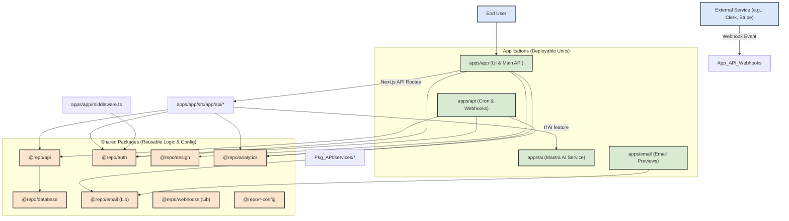

# Turbokit: The Developer's Map & Repo Guide

Welcome to Turbokit! This document is your central guide to understanding the structure of this Turborepo template and how to effectively build upon its foundation. It outlines the responsibilities of each application and package, and provides clear instructions on where to add different types of code modules.

## I. Turbokit High-Level Architecture

Turbokit is a Next.js 15 / React 19 monorepo built with Turborepo and pnpm. It's designed for scalability, developer experience, and robust feature development.

**Core Tenets:**

*   **Modularity:** Clear separation of concerns between applications (`apps/`) and shared logic (`packages/`).
*   **Type Safety:** Full TypeScript adoption with shared configurations.
*   **API-Driven:** A dedicated API layer (`@repo/api`) for business logic and data access.
*   **AI-Ready:** An integrated AI application (`apps/ai`) using Mastra for agent-based workflows.
*   **Modern Stack:** Leverages Next.js App Router, shadcn/ui, Prisma, Clerk, and Jotai.

**Overall Structure Diagram:**



## II. Detailed Module Breakdown & Code Placement

### A. Applications (`apps/`)

#### 1. `apps/app` (Main User-Facing Application)

*   **Purpose:** The primary Next.js application. Serves the frontend UI, handles user interactions, and hosts application-specific API routes.
*   **Responsibilities:**
    *   **UI Rendering:** All pages and client-side components.
    *   **User Authentication Flow:** Sign-in, sign-up pages leveraging `@repo/auth` and Clerk Elements.
    *   **Application API Endpoints:** Backend logic directly supporting the frontend features (e.g., CRUD for user-specific data, AI feature proxies).
    *   **Client-Side State:** Using Jotai atoms.
    *   **Data Fetching:** Using SWR hooks to call its own API routes or `@repo/api` services indirectly.
*   **Key Subdirectories & Code Placement:**
    *   **`src/app/(authenticated)/`**:
        *   `layout.tsx`: Main layout for logged-in users (includes Sidebar, Modals).
        *   `page.tsx`: Default authenticated landing page (currently "hello world", **replace this**).
        *   **New Feature Pages:** `your-feature/page.tsx`, `your-feature/[id]/page.tsx`.
    *   **`src/app/(unauthenticated)/`**:
        *   `signin/[[...sign-in]]/page.tsx`: Clerk Sign In.
        *   `signup/[[...sign-up]]/page.tsx`: Clerk Sign Up.
    *   **`src/app/api/`**:
        *   **User-Specific Data:** `user/me/preferences/route.ts` (existing example). Add new entity APIs here, e.g., `products/route.ts`, `products/[id]/route.ts`.
        *   **AI Proxies:** `ai/[featureName]/route.ts` (if you need to proxy requests to `apps/ai` with auth/logging). The existing `apps/app/src/app/api/chat/route.ts` (from the previous "Arbor" structure, if you kept it) would be an example. *If your blank slate doesn't have it, this is where you'd add it.*
    *   **`src/atoms/`**:
        *   `auth.ts`, `layout.ts`, `theme.ts` (existing).
        *   **New Feature State:** `yourEntityState.ts` for Jotai atoms related to new features.
    *   **`src/components/`**:
        *   `auth/`: Sign-in/Sign-up UI components (customizations for Clerk).
        *   `layout/`: Sidebar, Modals (`command/menu`, `command/overlay`, `delete-modal.tsx`, etc.).
        *   `shared/`: Reusable UI elements (e.g., `menu/`).
        *   **New Feature UI:** `app/[your-feature]/YourComponent.tsx`.
    *   **`src/hooks/`**:
        *   `use-keyboard.ts`, `use-modals.ts` (existing).
        *   **New Feature Data:** `[your-feature]/queries.ts` and `[your-feature]/mutations.ts` for SWR hooks.
    *   **`src/lib/`**:
        *   `utils/index.ts`: General client-side utilities.
        *   `mastra.ts`: Mastra client to interact with `apps/ai`.
    *   **`src/middleware.ts`**: Clerk authentication and route protection.
    *   **`.env.local` / `env.ts`**: App-specific environment variables.

#### 2. `apps/ai` (Mastra AI Service)

*   **Purpose:** Dedicated application for all AI agent logic, powered by Mastra.
*   **Responsibilities:**
    *   Defining and configuring AI agents (prompts, models, tools, memory).
    *   Executing AI workflows.
    *   Handling communication with LLMs and external tools for AI tasks.
*   **Key Subdirectories & Code Placement:**
    *   **`src/mastra/agents/`**:
        *   `example/books/`: Contains a multi-step book recommendation agent. **Use this as a comprehensive pattern for your own agents.**
            *   `detect-book/`, `execute-search/`, `get-book/`, `plan-search/`, `search-books/`: Each contains `index.ts` (agent definition) and `instructions.xml` (prompt).
        *   **New AI Agent:** Create `yourAgentName/index.ts` and `yourAgentName/instructions.xml`.
    *   **`src/mastra/tools/`**:
        *   `jina/`: Example custom tool for reading web content.
        *   `mcp/`: Example XML definitions for Mastra Connected Platform tools (e.g., `firecrawl.xml`).
        *   **New Custom Tool:** Create `yourToolName/index.ts` (logic) and `yourToolName/schema.ts` (Zod for input/output).
        *   **New MCP Tool:** Add `yourService.xml` to `mcp/`.
    *   **`src/mastra/utils/loadPrompt.ts`**: Utility for loading XML prompts.
    *   **`src/mastra/index.ts`**: Main Mastra instance. **Register new agents and workflows here.**
    *   **`.env.local` / `env.ts`**: AI-specific API keys (`OPENROUTER_API_KEY`, `FIRECRAWL_API_KEY`), `DATABASE_URL` (for Mastra memory).
    *   **`CLAUDE.md`**: Guide for AI (like Claude) on interacting with this specific app's codebase. **Update this as you add new agents/patterns.**

#### 3. `apps/api` (Standalone API for Cron & Webhooks)

*   **Purpose:** Hosts backend tasks that are not directly tied to a user request lifecycle, such as cron jobs and external webhook handlers.
*   **Responsibilities:**
    *   Executing scheduled tasks (cron jobs).
    *   Receiving and processing incoming webhooks from third-party services (e.g., Clerk, Stripe).
*   **Key Subdirectories & Code Placement:**
    *   **`src/app/cron/`**:
        *   `example/route.ts`: Placeholder. **Replace or remove.**
        *   `keep-alive/route.ts`: Useful for keeping serverless functions warm.
        *   **New Cron Job:** `[your-job-name]/route.ts`.
            *   Implement a `GET` handler.
            *   Use `executeCronJob` and `validateCronSecret` from `src/lib/cron.ts`.
            *   Add job to `CronJob` enum in `src/constants/cron.ts`.
            *   Add logic to `switch` statement in `src/lib/cron.ts executeCronJob`.
    *   **`src/app/webhooks/`**:
        *   `clerk/route.ts`: Existing Clerk webhook handler (good example for signature verification and event processing).
        *   **New Webhook:** `[service-name]/route.ts`.
    *   **`vercel.json`**: Define cron schedules here.
    *   **`.env.local` / `env.ts`**: Environment variables for this app (e.g., `CRON_SECRET`, webhook secrets).

#### 4. `apps/email` (React Email Development)

*   **Purpose:** For visually developing and testing email templates.
*   **Responsibilities:**
    *   Serving a local development environment for React Email.
*   **Key Subdirectories & Code Placement:**
    *   **`emails/invite.tsx`**: Example usage of a template from `@repo/email`. **Add more preview files here for new templates.**

## II. Building a New Feature: Step-by-Step Map

Let's say you're building a new feature, for example, managing "Posts".

### Step 1: Define Your Data (Database)

*   **File:** `packages/database/prisma/schema.prisma`
*   **Action:** Define the Prisma model for your new entity.
    ```prisma
    // Example for a "Post"
    model Post {
      id        String   @id @default(uuid())
      title     String
      content   String?  @db.Text
      published Boolean  @default(false)
      authorId  String   // Assuming a relation to User
      author    User     @relation(fields: [authorId], references: [id], onDelete: Cascade)
      createdAt DateTime @default(now())
      updatedAt DateTime @updatedAt

      @@index([authorId])
    }

    // Ensure your User model exists and can relate to Post
    model User {
      // ... existing fields (id, clerkId, etc.)
      posts Post[] // Add this relation
    }
    ```
*   **Guidance:**
    *   Think about fields, types, relations, and indexes.
    *   After saving, run `pnpm migrate` from the project root. This will prompt for a migration name and apply changes. Prisma Client will be auto-generated.

### Step 2: Define API Contracts (Schemas)

*   **Directory:** `packages/api/schemas/`
*   **Action:** Create a new file (e.g., `post.ts`) for Zod schemas related to your entity.
    ```typescript
    // packages/api/schemas/post.ts
    import { z } from 'zod';
    import { Post as PrismaPost } from '@repo/database'; // Import Prisma-generated type

    // Schema matching the Prisma model (for API responses)
    export const postSchema = z.object({
      id: z.string().uuid(),
      title: z.string(),
      content: z.string().nullish(),
      published: z.boolean(),
      authorId: z.string().uuid(),
      createdAt: z.date(),
      updatedAt: z.date(),
    });
    export type Post = z.infer<typeof postSchema>;

    // Schema for creating a new post (request body)
    export const createPostSchema = z.object({
      title: z.string().min(1, "Title is required"),
      content: z.string().optional(),
      published: z.boolean().optional().default(false),
    });
    export type CreatePostRequest = z.infer<typeof createPostSchema>;

    // Schema for updating a post (request body)
    export const updatePostSchema = z.object({
      title: z.string().min(1).optional(),
      content: z.string().optional().nullable(),
      published: z.boolean().optional(),
    });
    export type UpdatePostRequest = z.infer<typeof updatePostSchema>;

    // (Optional) Utility to map Prisma types to Zod types if needed
    export const fromPrisma = {
      post: (prismaPost: PrismaPost): Post => ({
        id: prismaPost.id,
        title: prismaPost.title,
        content: prismaPost.content,
        published: prismaPost.published,
        authorId: prismaPost.authorId,
        createdAt: prismaPost.createdAt,
        updatedAt: prismaPost.updatedAt,
      }),
    };
    ```
*   **Guidance:**
    *   Define schemas for your main entity, and for request bodies (create, update).
    *   Export both the schemas and their inferred TypeScript types.
    *   Update `packages/api/schemas/index.ts` to re-export your new schemas.

### Step 3: Implement Business Logic (API Service Layer)

*   **Directory:** `packages/api/services/`
*   **Action:** Create a new service file (e.g., `postService.ts`).
    ```typescript
    // packages/api/services/postService.ts
    import { database as db } from '@repo/database';
    import { ApiError, validateWith } from '../lib/response'; // Assuming these are in @repo/api
    import { ErrorType, ResourceType } from '../constants';
    import {
      Post,
      CreatePostRequest,
      UpdatePostRequest,
      createPostSchema, // For validating input if service is called directly
      updatePostSchema,
      fromPrisma,
    } from '../schemas/post';

    class PostService {
      async getPostById(postId: string, userId: string): Promise<Post | null> {
        const post = await db.post.findUnique({ where: { id: postId } });
        if (!post) return null;
        // Optional: Check if userId has permission to view this post
        if (post.authorId !== userId) { /* throw ApiError.unauthorized(); */ }
        return fromPrisma.post(post);
      }

      async getPostsByUserId(userId: string): Promise<Post[]> {
        const posts = await db.post.findMany({
          where: { authorId: userId },
          orderBy: { createdAt: 'desc' },
        });
        return posts.map(fromPrisma.post);
      }

      async createPost(userId: string, data: CreatePostRequest): Promise<Post> {
        // Validation can happen here or at the API route level.
        // const validatedData = await validateWith(createPostSchema, data);
        const newPost = await db.post.create({
          data: {
            ...data, // Spread validatedData if validation is done here
            authorId: userId,
          },
        });
        return fromPrisma.post(newPost);
      }

      async updatePost(postId: string, userId: string, data: UpdatePostRequest): Promise<Post> {
        const post = await db.post.findUnique({ where: { id: postId }});
        if (!post || post.authorId !== userId) {
          throw ApiError.notFound(ResourceType.POST, postId); // Or unauthorized
        }
        // const validatedData = await validateWith(updatePostSchema, data);
        const updatedPost = await db.post.update({
          where: { id: postId },
          data: data, // Spread validatedData if validation is done here
        });
        return fromPrisma.post(updatedPost);
      }

      async deletePost(postId: string, userId: string): Promise<void> {
        const post = await db.post.findUnique({ where: { id: postId }});
        if (!post || post.authorId !== userId) {
          throw ApiError.notFound(ResourceType.POST, postId); // Or unauthorized
        }
        await db.post.delete({ where: { id: postId } });
      }
    }
    export const postService = new PostService();
    ```
*   **Guidance:**
    *   Import `database` from `@repo/database`.
    *   Import schemas and types from `../schemas/`.
    *   Implement methods for CRUD operations and any other business logic.
    *   Perform authorization checks (e.g., "does this user own this post?").
    *   Update `packages/api/index.ts` to export your new service.

### Step 4: Expose Logic via API Routes

*   **Directory:** `apps/app/src/app/api/`
*   **Action:** Create API route handlers.
    *   **Collection (`apps/app/src/app/api/posts/route.ts`):**
        ```typescript
        import { NextRequest } from 'next/server';
        import { successResponse, validateWith, withErrorHandling } from '@repo/api/lib/response';
        import { createPostSchema, postSchema } from '@repo/api/schemas/post';
        import { postService } from '@repo/api/services/post';
        import { withAuthenticatedUser } from '@/lib/auth'; // Your app-specific auth HOF
        import { User } from '@repo/database';

        // GET /api/posts - List posts for the authenticated user
        export const GET = withErrorHandling(
          withAuthenticatedUser(async function getPosts(
            request: NextRequest,
            context: { user: User }
          ) {
            const posts = await postService.getPostsByUserId(context.user.id);
            return successResponse(posts.map(p => postSchema.parse(p))); // Validate output
          })
        );

        // POST /api/posts - Create a new post
        export const POST = withErrorHandling(
          withAuthenticatedUser(async function createPost(
            request: NextRequest,
            context: { user: User }
          ) {
            const body = await request.json();
            const validatedData = await validateWith(createPostSchema, body);
            const newPost = await postService.createPost(context.user.id, validatedData);
            return successResponse(postSchema.parse(newPost), 201); // Validate output
          })
        );
        ```
    *   **Individual Resource (`apps/app/src/app/api/posts/[id]/route.ts`):**
        ```typescript
        import { NextRequest } from 'next/server';
        import { successResponse, validateWith, withErrorHandling, ApiError } from '@repo/api/lib/response';
        import { updatePostSchema, postSchema } from '@repo/api/schemas/post';
        import { postService } from '@repo/api/services/post';
        import { withAuthenticatedUser } from '@/lib/auth';
        import { User } from '@repo/database';
        import { ErrorType } from '@repo/api/constants';

        interface RouteContext { params: { id: string }; user: User }

        // GET /api/posts/[id] - Get a single post
        export const GET = withErrorHandling(
          withAuthenticatedUser(async function getPost(
            request: NextRequest,
            context: RouteContext
          ) {
            const post = await postService.getPostById(context.params.id, context.user.id);
            if (!post) throw ApiError.notFound('Post');
            return successResponse(postSchema.parse(post));
          })
        );

        // PUT /api/posts/[id] - Update a post
        export const PUT = withErrorHandling(
          withAuthenticatedUser(async function updatePost(
            request: NextRequest,
            context: RouteContext
          ) {
            const body = await request.json();
            const validatedData = await validateWith(updatePostSchema, body);
            const updatedPost = await postService.updatePost(context.params.id, context.user.id, validatedData);
            return successResponse(postSchema.parse(updatedPost));
          })
        );

        // DELETE /api/posts/[id] - Delete a post
        export const DELETE = withErrorHandling(
          withAuthenticatedUser(async function deletePost(
            request: NextRequest,
            context: RouteContext
          ) {
            await postService.deletePost(context.params.id, context.user.id);
            return successResponse({ message: 'Post deleted successfully' });
          })
        );
        ```
*   **Guidance:**
    *   Use the HOFs `withErrorHandling` and `withAuthenticatedUser`.
    *   Call the appropriate service methods.
    *   Validate request bodies/params and response data with Zod schemas.

### Step 5: Implement Frontend (Pages, Components, Hooks, State)

*   **SWR Hooks (`apps/app/src/hooks/[entity]/`):**
    *   **Action:** Create `queries.ts` and `mutations.ts` for your entity.
    *   **`queries.ts` (e.g., `apps/app/src/hooks/post/queries.ts`):**
        ```typescript
        import useSWR from 'swr';
        import { Post } from '@repo/api/schemas/post';
        import { fetcher } from '@/lib/utils'; // Your app's fetcher utility

        export function usePosts() {
          const { data, error, isLoading, mutate } = useSWR<{ success: boolean, data: Post[] }>('/api/posts', fetcher);
          return { posts: data?.data, error, isLoading, mutatePosts: mutate };
        }

        export function usePost(id: string | null) {
          const { data, error, isLoading, mutate } = useSWR<{ success: boolean, data: Post }>(
            id ? `/api/posts/${id}` : null,
            fetcher
          );
          return { post: data?.data, error, isLoading, mutatePost: mutate };
        }
        ```
    *   **`mutations.ts` (e.g., `apps/app/src/hooks/post/mutations.ts`):**
        ```typescript
        import useSWRMutation from 'swr/mutation';
        import { CreatePostRequest, UpdatePostRequest, Post } from '@repo/api/schemas/post';

        async function createPostFetcher(url: string, { arg }: { arg: CreatePostRequest }) {
          const res = await fetch(url, { method: 'POST', body: JSON.stringify(arg), headers: {'Content-Type': 'application/json'} });
          if (!res.ok) throw new Error('Failed to create post');
          return (await res.json()).data as Post;
        }
        export function useCreatePost() {
          return useSWRMutation('/api/posts', createPostFetcher);
        }
        // ... similar for update and delete
        ```
*   **Jotai Atoms (`apps/app/src/atoms/`):**
    *   **Action:** Create `post.ts` if you need client-side state for posts (e.g., filters, selected post).
        ```typescript
        import { atom } from 'jotai';
        import { Post } from '@repo/api/schemas/post';

        export const selectedPostAtom = atom<Post | null>(null);
        export const postFiltersAtom = atom<{ status: 'published' | 'draft' | 'all' }>({ status: 'all' });
        ```
*   **Components (`apps/app/src/components/app/[entity]/`):**
    *   **Action:** Create React components for displaying and interacting with your entity.
    *   **Examples:** `PostList.tsx`, `PostCard.tsx`, `PostForm.tsx`.
    *   **Guidance:** Use `@repo/design` components. Fetch data via SWR hooks. Manage local UI state with `useState` or Jotai.
*   **Pages (`apps/app/src/app/(authenticated)/`):**
    *   **Action:** Create new page routes.
    *   **`posts/page.tsx` (List View):**
        ```tsx
        'use client';
        import { usePosts } from '@/hooks/post/queries';
        // import PostList from '@/components/app/post/PostList';

        export default function PostsPage() {
          const { posts, isLoading, error } = usePosts();
          if (isLoading) return <p>Loading...</p>;
          if (error) return <p>Error loading posts.</p>;
          // return <PostList posts={posts || []} />;
          return <pre>{JSON.stringify(posts, null, 2)}</pre> // Placeholder
        }
        ```
    *   **`posts/[id]/page.tsx` (Detail View):**
        ```tsx
        'use client';
        import { usePost } from '@/hooks/post/queries';
        // import PostDetail from '@/components/app/post/PostDetail';

        export default function PostDetailPage({ params }: { params: { id: string } }) {
          const { post, isLoading, error } = usePost(params.id);
          if (isLoading) return <p>Loading...</p>;
          if (error || !post) return <p>Post not found.</p>;
          // return <PostDetail post={post} />;
          return <pre>{JSON.stringify(post, null, 2)}</pre> // Placeholder
        }
        ```
*   **Guidance:**
    *   Use `'use client'` for components that need interactivity or hooks.
    *   Fetch data using your SWR hooks.
    *   Pass data to presentational components.

### Step 6: AI Integration (If Applicable)

If your feature involves AI:

1.  **Define Agent & Prompt (`apps/ai/src/mastra/agents/yourFeatureAgent/`):**
    *   Create `index.ts` for the agent logic.
    *   Create `instructions.xml` for the prompt.
    *   Configure `memory.ts` if it needs specific memory handling.
    *   Register the agent in `apps/ai/src/mastra/index.ts`.
2.  **Define Tools (`apps/ai/src/mastra/tools/`):**
    *   If the agent needs to call external APIs or perform specific actions, define these as Mastra tools (XML for MCP, or custom code).
3.  **Create API Proxy in `apps/app` (`apps/app/src/app/api/ai/[featureName]/route.ts`):**
    *   This route will take user input for the AI feature.
    *   It will use `@repo/ai`'s `mastra` client to call the agent in `apps/ai`.
    *   It will stream the AI's response back to the frontend.
    *   It should also save relevant interactions to your database via `@repo/api/services/`.
4.  **Frontend Interaction (`apps/app/src/components/app/[feature]/AIComponent.tsx`):**
    *   Use `@ai-sdk/react`'s `useChat` hook, pointing to your new AI API proxy.
    *   Build UI for input and displaying AI responses (including streaming text, tool calls, etc.).

---

## III. Development Workflow Summary

1.  **Define Feature & Data Model:** Start with `packages/database/prisma/schema.prisma`.
2.  **API Layer:**
    *   Schemas: `packages/api/schemas/`.
    *   Services: `packages/api/services/`.
3.  **Expose API:**
    *   App-specific: `apps/app/src/app/api/`.
    *   Cron/Webhook: `apps/api/src/app/cron/` or `webhooks/`.
4.  **Frontend (`apps/app`):**
    *   Hooks: `src/hooks/`.
    *   Atoms: `src/atoms/`.
    *   Components: `src/components/`.
    *   Pages: `src/app/(authenticated)/`.
5.  **AI (`apps/ai` & `@repo/ai`):**
    *   Agents & Prompts: `apps/ai/src/mastra/agents/`.
    *   Tools: `apps/ai/src/mastra/tools/`.
    *   Client calls from `apps/app` via `@repo/ai`.
6.  **Shared UI:** `packages/design/`.
7.  **Emails:** Templates in `packages/email/templates/`, previews in `apps/email/emails/`.

## IV. Specific Functionality Map

*   **Adding a New API Endpoint:**
    1.  `packages/api/schemas/`: Define Zod schemas for request/response.
    2.  `packages/api/services/`: Implement business logic.
    3.  `apps/app/src/app/api/...`: Create the route handler.
*   **Adding a Cron Job:**
    1.  `apps/app/src/app/api/cron/[job-name]/route.ts`: Create a `GET` handler.
    2.  `apps/app/vercel.json`: Define the schedule.
    3.  Implement the job's logic, likely calling services from `@repo/api`.
*   **Interacting with an LLM:**
    1.  **Agent Definition:** `apps/ai/src/mastra/agents/`.
    2.  **API Proxy:** `apps/app/src/app/api/chat/` (or feature-specific AI endpoint).
    3.  **Frontend:** `apps/app/src/components/app/chat/` (using `useChat`).
    4.  **Client Library:** `@repo/ai` (Mastra client).
*   **Modifying Database Schema:**
    1.  `packages/database/prisma/schema.prisma`.
    2.  Run `pnpm migrate`.
    3.  Update corresponding Zod schemas in `packages/api/schemas/`.
    4.  Update service methods in `packages/api/services/`.
*   **Adding a New Shared UI Component:**
    1.  `packages/design/components/ui/` (if extending shadcn/ui) or `packages/design/components/` (for custom shared components).
    2.  Export from `packages/design/index.tsx` if needed globally.
*   **Adding a New Page Route:**
    1.  `apps/app/src/app/(authenticated)/.../page.tsx` (or `(unauthenticated)`).
    2.  Consider an accompanying `layout.tsx` if needed.
*   **Adding Client-Side State:**
    1.  `apps/app/src/atoms/`: Define Jotai atoms.
*   **Adding Client-Side Data Fetching:**
    1.  `apps/app/src/hooks/[entity]/queries.ts`: SWR query hooks.
    2.  `apps/app/src/hooks/[entity]/mutations.ts`: SWR mutation hooks.

This comprehensive map should equip you or an AI agent to navigate and build upon the Turbokit template effectively, ensuring code is organized, maintainable, and adheres to best practices.