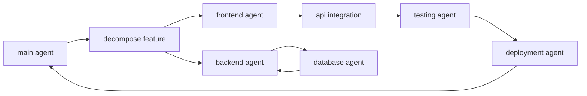
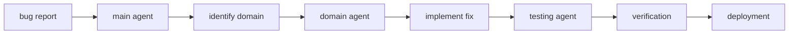

# [project-name]: multi-agent coordination system

this document defines how multiple ai agents should coordinate to develop, maintain, and enhance this codebase. each agent has specific responsibilities and handoff protocols.

## agent architecture

### main agent
the primary orchestrator that understands the full system context and delegates specialized tasks.

**responsibilities**:
- interpret user requirements
- break down complex tasks
- coordinate sub-agents
- maintain project coherence
- handle cross-cutting concerns

**capabilities**:
- full codebase access
- task decomposition
- agent selection
- conflict resolution
- final integration

### sub-agent specializations

#### frontend development agent
**domain**: `apps/app/` directory

**responsibilities**:
- ui component creation
- state management implementation
- user interaction flows
- responsive design
- accessibility compliance

**expertise**:
- react 19 patterns
- next.js 15 app router
- tailwind css v4
- shadcn/ui components
- jotai state management

**handoff triggers**:
- api integration needed → backend agent
- database schema changes → database agent
- visual design updates → design agent

#### backend api agent
**domain**: `apps/api/` and `packages/services/`

**responsibilities**:
- api endpoint creation
- business logic implementation
- authentication/authorization
- data validation
- error handling

**expertise**:
- next.js api routes
- service layer patterns
- clerk authentication
- input validation
- response formatting

**handoff triggers**:
- database operations → database agent
- frontend integration → frontend agent
- deployment config → deployment agent

#### database design agent
**domain**: `packages/database/`

**responsibilities**:
- schema design
- migration creation
- query optimization
- data modeling
- seed data management

**expertise**:
- prisma/drizzle orm
- postgresql
- database normalization
- indexing strategies
- relationship modeling

**handoff triggers**:
- api implementation → backend agent
- type generation → frontend agent
- performance issues → optimization agent

#### testing automation agent
**domain**: test files throughout codebase

**responsibilities**:
- test creation
- test maintenance
- coverage analysis
- ci/cd integration
- regression prevention

**expertise**:
- jest/vitest
- react testing library
- playwright e2e
- test patterns
- mock strategies

**handoff triggers**:
- failing tests → relevant domain agent
- coverage gaps → main agent
- performance tests → optimization agent

#### deployment orchestration agent
**domain**: configuration and deployment files

**responsibilities**:
- environment configuration
- deployment scripts
- ci/cd pipelines
- monitoring setup
- rollback procedures

**expertise**:
- vercel deployment
- github actions
- environment variables
- docker configuration
- monitoring tools

**handoff triggers**:
- build errors → relevant domain agent
- performance issues → optimization agent
- security concerns → security agent

## workflow patterns

### feature development workflow


1. **main agent** analyzes requirements
2. **frontend agent** creates ui components
3. **backend agent** implements api
4. **database agent** updates schema if needed
5. **testing agent** creates tests
6. **deployment agent** prepares deployment
7. **main agent** verifies integration

### bug fixing workflow


1. **main agent** triages bug
2. identifies affected domain
3. **domain agent** investigates and fixes
4. **testing agent** verifies fix
5. **deployment agent** deploys patch

### refactoring workflow
1. **main agent** identifies refactoring needs
2. **relevant agents** propose changes
3. **testing agent** ensures no regression
4. **main agent** coordinates implementation
5. **deployment agent** stages rollout

### documentation workflow
1. **main agent** identifies documentation gaps
2. **domain agents** provide technical details
3. documentation updated in parallel
4. **main agent** ensures consistency

## coordination rules

### agent handoff protocol
```typescript
interface AgentHandoff {
  from: AgentType
  to: AgentType
  task: {
    description: string
    context: any
    requirements: string[]
    constraints: string[]
  }
  artifacts: {
    files: string[]
    dependencies: string[]
    tests: string[]
  }
}
```

### conflict resolution
when agents disagree:
1. **technical conflicts**: defer to domain expert agent
2. **architectural conflicts**: escalate to main agent
3. **performance vs simplicity**: prioritize user experience
4. **breaking changes**: require main agent approval

### priority management
```
priority levels:
1. critical: security, data loss, system down
2. high: broken features, performance issues
3. medium: new features, improvements
4. low: refactoring, documentation
```

### error handling
```typescript
interface AgentError {
  agent: AgentType
  error: {
    type: 'compilation' | 'runtime' | 'logic' | 'integration'
    message: string
    context: any
  }
  recovery: {
    strategy: 'retry' | 'escalate' | 'rollback'
    fallback?: any
  }
}
```

## communication protocols

### status updates
agents should report:
- task acceptance
- progress milestones
- blockers encountered
- handoff initiation
- task completion

### knowledge sharing
agents share:
- discovered patterns
- identified anti-patterns
- performance insights
- security concerns
- improvement suggestions

### context preservation
between handoffs maintain:
- task objectives
- constraints and requirements
- decisions made
- alternatives considered
- test coverage

## quality gates

### before handoff
- [ ] code compiles without errors
- [ ] tests pass
- [ ] types are correct
- [ ] documentation updated
- [ ] no security issues

### before integration
- [ ] all agents complete
- [ ] integration tests pass
- [ ] performance acceptable
- [ ] review complete
- [ ] deployment ready

## agent capabilities matrix

| capability | main | frontend | backend | database | testing | deployment |
|------------|------|----------|---------|----------|---------|------------|
| read all files | ✓ | ✓ | ✓ | ✓ | ✓ | ✓ |
| modify ui | | ✓ | | | | |
| modify api | | | ✓ | | | |
| modify schema | | | | ✓ | | |
| create tests | | | | | ✓ | |
| deploy code | | | | | | ✓ |
| coordinate | ✓ | | | | | |

## best practices

### for all agents
- maintain single responsibility
- communicate state clearly
- validate inputs and outputs
- handle errors gracefully
- preserve existing functionality

### for main agent
- maintain big picture view
- ensure consistency
- prevent scope creep
- manage dependencies
- document decisions

### for specialized agents
- stay within domain boundaries
- follow established patterns
- request help when uncertain
- validate against requirements
- maintain backward compatibility

## escalation paths

### when to escalate to main agent
- cross-domain changes needed
- architectural decisions required
- breaking changes proposed
- security implications identified
- performance degradation detected

### when to request human intervention
- ambiguous requirements
- critical security issues
- data loss potential
- legal/compliance concerns
- major architectural changes

---

*this document defines the multi-agent collaboration framework. agents should refer to this for coordination protocols and responsibilities.*