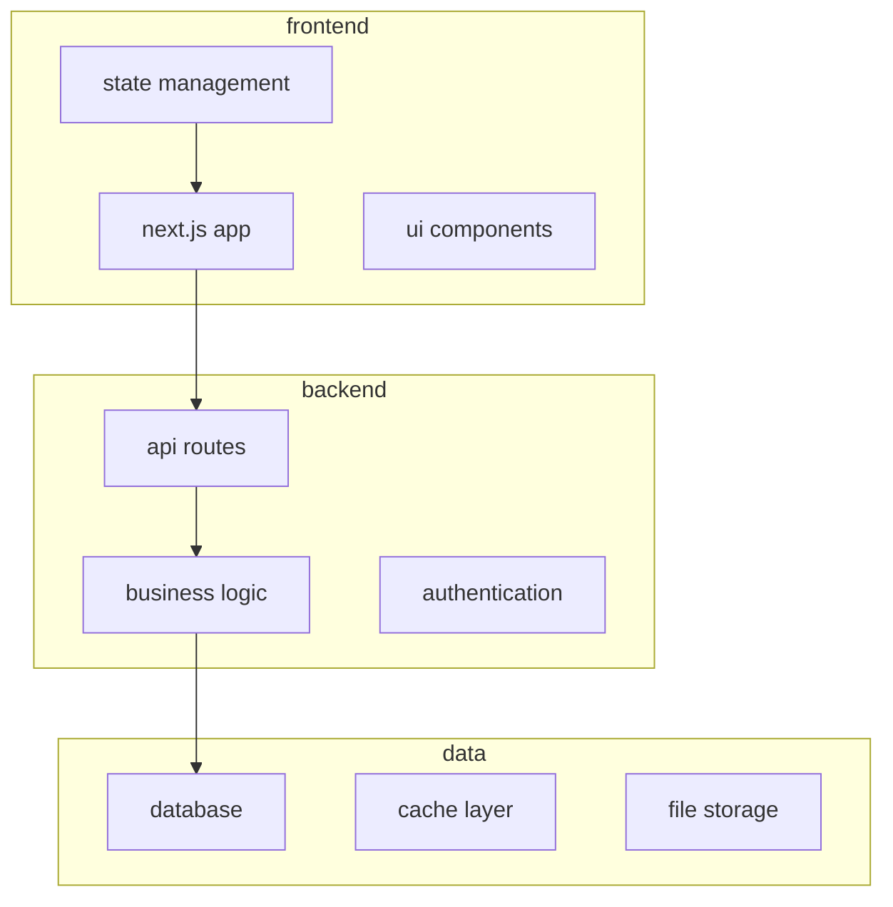

# [project-name]: codebase map and ai developer guide

this document serves as the primary reference for understanding and developing this codebase. it's designed for ai agents and developers working with ai-assisted tools.

## project overview

### what this does
[clear description of the project's purpose and functionality]

### target users
[who will use this application and why]

### key differentiators
[what makes this project unique or valuable]

## architecture

### system components


### data flow patterns
- user interactions trigger ui events
- ui calls api endpoints via swr/fetch
- api routes validate and process requests
- services handle business logic
- database operations through orm
- responses flow back through layers

### tech stack
- **frontend**: next.js 15, react 19, typescript, tailwind css v4
- **state**: jotai (ui state), swr (server state with rsc hydration)
- **backend**: orpc (type-safe rpc), services layer, cloudflare workers
- **database**: postgresql with drizzle + drizzle-zod
- **auth**: clerk
- **ai**: mastra framework (deployed to mastra cloud)
- **deployment**: vercel (web), cloudflare (api), mastra cloud (ai)

## development patterns

### component structure
```
components/
├── ui/           # shadcn/ui base components
├── features/     # feature-specific components
├── layouts/      # page layouts
└── providers/    # context providers
```

### state management approach
- **jotai**: ui state (modals, loading, user preferences)
- **swr**: server data fetching and caching
- **context**: auth and theme only
- **url**: navigation and filtering state

### api design patterns

#### orpc layer (primary api)
```typescript
// packages/orpc/routers/user.router.ts
export const userRouter = router({
  get: procedure
    .input(z.object({ id: z.string() }))
    .query(async ({ input, ctx }) => {
      // only delegates to services
      return ctx.services.user.findById(input.id)
    }),
})
```

#### cloudflare workers (external api)
```typescript
// apps/api/src/routes/webhook.ts
app.post('/webhook/stripe', async (c) => {
  const body = await c.req.json()
  // validate webhook signature
  // delegate to services
  await services.payment.handleWebhook(body)
  return c.json({ received: true })
})
```

### database schema philosophy
- normalized for consistency
- denormalized for performance where needed
- soft deletes for audit trails
- timestamps on all records

## agent instructions

### adding new features

1. **ui component**: create in `apps/app/components/features/`
2. **api endpoint**: add to `apps/app/app/api/`
3. **business logic**: implement in `packages/services/`
4. **database changes**: update schema in `packages/database/`
5. **type definitions**: add to relevant `.types.ts` files

### where code belongs

| code type | location | example |
|-----------|----------|---------|
| ui components | `apps/app/components/` | button.tsx |
| orpc routers | `packages/orpc/routers/` | user.router.ts |
| business logic | `packages/services/` | user.service.ts |
| database schema | `packages/database/schema/` | users.ts |
| database types | `packages/database/types/` | generated via drizzle-zod |
| external api | `apps/api/src/routes/` | webhook.ts |
| ai agents | `apps/mastra/src/mastra/agents/` | assistant.ts |

### testing approach
- unit tests for utilities and services
- integration tests for api endpoints
- component tests for critical ui
- e2e tests for user workflows

### deployment considerations
- environment variables in `.env.local`
- database migrations before deploy
- feature flags for gradual rollout
- monitoring with sentry/posthog

## quick reference

### key commands
```bash
# development
pnpm dev          # start dev server
pnpm build        # production build
pnpm test         # run tests
pnpm lint         # lint code

# database
pnpm db:push      # push schema changes
pnpm db:migrate   # run migrations
pnpm db:seed      # seed data
pnpm db:studio    # open prisma studio

# deployment
pnpm deploy       # deploy to production
pnpm preview      # preview deployment
```

### environment variables
```env
# authentication
NEXT_PUBLIC_CLERK_PUBLISHABLE_KEY=
CLERK_SECRET_KEY=

# database
DATABASE_URL=

# optional services
POSTHOG_KEY=
SENTRY_DSN=
OPENAI_API_KEY=
```

### common tasks

#### create new component
```bash
# use shadcn/ui cli
pnpm dlx shadcn@latest add [component]

# or create manually in components/features/
```

#### add api endpoint
```typescript
// apps/app/app/api/[resource]/route.ts
import { auth } from '@clerk/nextjs'

export async function GET() {
  const { userId } = await auth()
  if (!userId) return Response.json({ error: 'unauthorized' }, { status: 401 })
  
  // implementation
}
```

#### update database schema
```prisma
// packages/database/schema.prisma
model NewModel {
  id        String   @id @default(cuid())
  // fields
  createdAt DateTime @default(now())
  updatedAt DateTime @updatedAt
}
```

### troubleshooting

| issue | solution |
|-------|----------|
| types not updating | run `pnpm build` in packages |
| database errors | check connection string |
| auth not working | verify clerk keys |
| styles not applying | check tailwind config |

## navigation guide

### key files
- `turbo.json` - monorepo configuration
- `apps/app/app/layout.tsx` - root layout
- `packages/database/schema.prisma` - database schema
- `.env.example` - environment template

### important directories
- `apps/` - deployable applications
- `packages/` - shared code
- `docs/` - project documentation
- `.cursor/rules/` - ai coding rules

## performance considerations

- use dynamic imports for heavy components
- implement pagination for lists
- cache api responses with swr
- optimize images with next/image
- lazy load non-critical features

## security notes

- all api routes require authentication
- input validation on client and server
- parameterized database queries
- environment variables for secrets
- rate limiting on sensitive endpoints

---

*this document is the source of truth for ai-assisted development. keep it updated as the codebase evolves.*