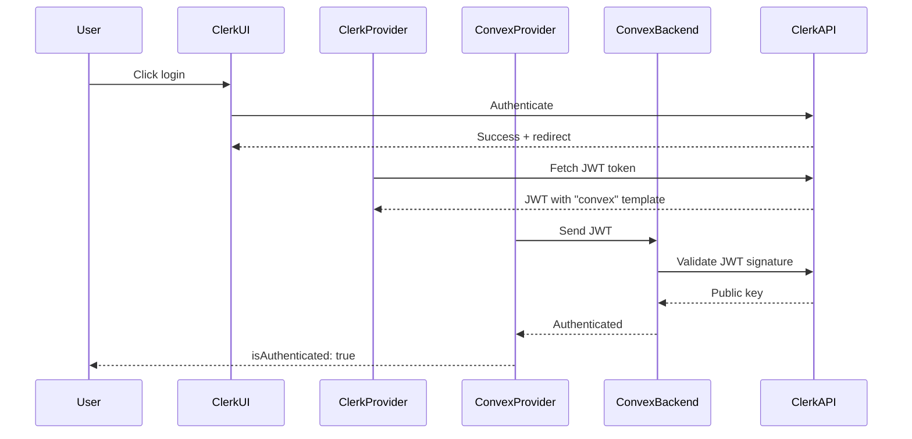

# Auth Package - AI Agent Instructions

## Overview
This package provides Clerk authentication integration for TurboKit applications, handling both client-side UI and server-side JWT validation with Convex. Implements the official Clerk + Convex integration pattern with webhook-based user synchronization.

## Quick Start Checklist
- [ ] Create Clerk application and configure auth methods
- [ ] Create JWT template named "convex" in Clerk Dashboard
- [ ] Set environment variables (publishable key, issuer domain, webhook secret)
- [ ] Deploy auth.config.ts to Convex
- [ ] Configure webhook endpoint in Clerk Dashboard
- [ ] Test user sync and authentication flow
- [ ] Set up protected routes with middleware

## Setup & Configuration

### Environment Variables

#### Client-Side (Next.js)
```env
# Required for Clerk UI components
NEXT_PUBLIC_CLERK_PUBLISHABLE_KEY=pk_test_...  # Dev: pk_test_, Prod: pk_live_

# Optional - Custom auth routes (defaults shown)
NEXT_PUBLIC_CLERK_SIGN_IN_URL=/signin  # Default: /sign-in
NEXT_PUBLIC_CLERK_SIGN_UP_URL=/signup  # Default: /sign-up
NEXT_PUBLIC_CLERK_AFTER_SIGN_IN_URL=/dashboard  # Default: /
NEXT_PUBLIC_CLERK_AFTER_SIGN_UP_URL=/onboarding  # Default: /

# Only needed server-side in Next.js
CLERK_SECRET_KEY=sk_test_...  # For Next.js middleware
```

#### Server-Side (Convex Dashboard)
```env
# Set these in Convex Dashboard Environment Variables
CLERK_JWT_ISSUER_DOMAIN=https://verb-noun-00.clerk.accounts.dev  # Dev format
# Production: https://clerk.your-domain.com

CLERK_WEBHOOK_SECRET=whsec_...  # From Clerk Dashboard webhook settings
```

### Initial Setup (Step-by-Step)

#### 1. Create Clerk Application
1. Sign up at [clerk.com](https://clerk.com)
2. Create new application
3. Choose authentication methods:
   - Email/Password
   - Social providers (Google, GitHub, etc.)
   - OTP (email/SMS codes)
   - Multi-factor authentication

#### 2. Create JWT Template (Critical!)
1. In Clerk Dashboard → JWT Templates
2. Click "New template" → Select "Convex"
3. **DO NOT rename the template - must be called "convex"**
4. Copy the Issuer URL (your Frontend API URL)
   - Dev: `https://verb-noun-00.clerk.accounts.dev`
   - Prod: `https://clerk.your-domain.com`

#### 3. Configure Convex Backend
```typescript
// packages/backend/convex/auth.config.ts
export default {
  providers: [
    {
      domain: process.env.CLERK_JWT_ISSUER_DOMAIN,
      applicationID: "convex",  // Must match JWT template name
    },
  ],
};
```

#### 4. Configure Webhook for User Sync
1. In Clerk Dashboard → Webhooks
2. Add endpoint: `https://your-project.convex.site/clerk/webhook`
3. Select events:
   - `user.created`
   - `user.updated`
   - `user.deleted`
4. Copy webhook signing secret to Convex environment

## Authentication Flow (Under the Hood)



## Usage Patterns

### Client-Side Authentication

#### Provider Setup (Next.js App Router)
```typescript
// app/providers/ConvexClientProvider.tsx
'use client';

import { ReactNode } from 'react';
import { ConvexReactClient } from 'convex/react';
import { ConvexProviderWithClerk } from 'convex/react-clerk';
import { useAuth } from '@clerk/nextjs';

const convex = new ConvexReactClient(process.env.NEXT_PUBLIC_CONVEX_URL!);

export default function ConvexClientProvider({
  children
}: {
  children: ReactNode
}) {
  return (
    <ConvexProviderWithClerk client={convex} useAuth={useAuth}>
      {children}
    </ConvexProviderWithClerk>
  );
}

// app/layout.tsx
import { ClerkProvider } from '@clerk/nextjs';
import ConvexClientProvider from '@/providers/ConvexClientProvider';

export default function RootLayout({ children }) {
  return (
    <html>
      <body>
        <ClerkProvider>
          <ConvexClientProvider>
            {children}
          </ConvexClientProvider>
        </ClerkProvider>
      </body>
    </html>
  );
}
```

#### Authentication State Components
```typescript
// ⚠️ IMPORTANT: Use Convex components, not Clerk's!
import {
  Authenticated,     // ✅ Use this (from convex/react)
  Unauthenticated,  // ✅ Use this (from convex/react)
  AuthLoading       // ✅ Use this (from convex/react)
} from 'convex/react';

// ❌ Don't use these Clerk components:
// SignedIn, SignedOut, ClerkLoading

function App() {
  return (
    <>
      <Unauthenticated>
        <SignInButton />  {/* Clerk component is OK here */}
      </Unauthenticated>

      <Authenticated>
        <UserButton />     {/* Clerk component is OK here */}
        <SecureContent />  {/* Guaranteed authenticated */}
      </Authenticated>

      <AuthLoading>
        <Spinner />
      </AuthLoading>
    </>
  );
}
```

#### Check Auth Status
```typescript
// ⚠️ IMPORTANT: Use useConvexAuth, not useAuth!
import { useConvexAuth } from 'convex/react';  // ✅ Correct
// import { useAuth } from '@clerk/nextjs';     // ❌ Wrong for checking auth

function Component() {
  const { isAuthenticated, isLoading } = useConvexAuth();

  if (isLoading) return <Loading />;
  if (!isAuthenticated) return <SignInPrompt />;

  return <AuthenticatedContent />;
}
```

### Server-Side Authentication (Convex)

#### Require Authentication (Most Common)
```typescript
// packages/backend/convex/functions/queries/projects.ts
import { query } from "../../_generated/server";
import { ConvexError } from "convex/values";

export const list = query({
  args: {},
  handler: async (ctx) => {
    const identity = await ctx.auth.getUserIdentity();

    if (!identity) {
      throw new ConvexError("Not authenticated");
    }

    // identity contains JWT claims:
    // - subject: Clerk user ID
    // - email: User's email
    // - name: User's name
    // - pictureUrl: Profile image

    return await ctx.db
      .query("projects")
      .filter((q) => q.eq(q.field("userId"), identity.subject))
      .collect();
  },
});
```

#### Helper Functions for Auth
```typescript
// packages/backend/convex/lib/auth.ts
import { ConvexError } from "convex/values";

export async function requireAuth(ctx: any) {
  const identity = await ctx.auth.getUserIdentity();

  if (!identity) {
    throw new ConvexError("Authentication required");
  }

  // Get full user from database
  const user = await ctx.db
    .query("users")
    .withIndex("by_clerk_id", (q) => q.eq("clerkId", identity.subject))
    .unique();

  if (!user) {
    throw new ConvexError("User not found in database");
  }

  return { identity, user };
}

export async function optionalAuth(ctx: any) {
  const identity = await ctx.auth.getUserIdentity();

  if (!identity) return null;

  const user = await ctx.db
    .query("users")
    .withIndex("by_clerk_id", (q) => q.eq("clerkId", identity.subject))
    .unique();

  return user ? { identity, user } : null;
}
```

### User Synchronization via Webhooks

#### Webhook Handler
```typescript
// packages/backend/convex/http/webhooks/clerk.ts
import { httpAction } from "../../_generated/server";
import { internal } from "../../_generated/api";
import { Webhook } from "svix";

export const clerkWebhook = httpAction(async (ctx, request) => {
  // Validate webhook signature
  const webhookSecret = process.env.CLERK_WEBHOOK_SECRET;
  if (!webhookSecret) {
    throw new Error("Missing CLERK_WEBHOOK_SECRET");
  }

  const svixId = request.headers.get("svix-id");
  const svixTimestamp = request.headers.get("svix-timestamp");
  const svixSignature = request.headers.get("svix-signature");

  if (!svixId || !svixTimestamp || !svixSignature) {
    return new Response("Missing svix headers", { status: 400 });
  }

  const payload = await request.text();
  const wh = new Webhook(webhookSecret);

  let event;
  try {
    event = wh.verify(payload, {
      "svix-id": svixId,
      "svix-timestamp": svixTimestamp,
      "svix-signature": svixSignature,
    });
  } catch (err) {
    return new Response("Invalid signature", { status: 400 });
  }

  // Handle different event types
  switch (event.type) {
    case "user.created":
    case "user.updated": {
      await ctx.runMutation(internal.users.internal.syncUser, {
        clerkId: event.data.id,
        email: event.data.email_addresses[0]?.email_address,
        name: `${event.data.first_name || ""} ${event.data.last_name || ""}`.trim(),
        imageUrl: event.data.image_url,
      });
      break;
    }

    case "user.deleted": {
      await ctx.runMutation(internal.users.internal.deleteUser, {
        clerkId: event.data.id,
      });
      break;
    }

    default:
      console.log("Unhandled webhook event:", event.type);
  }

  return new Response(null, { status: 200 });
});
```

#### User Sync Mutations
```typescript
// packages/backend/convex/users/internal.ts
import { internalMutation } from "../_generated/server";
import { v } from "convex/values";

export const syncUser = internalMutation({
  args: {
    clerkId: v.string(),
    email: v.string(),
    name: v.string(),
    imageUrl: v.optional(v.string()),
  },
  handler: async (ctx, args) => {
    const existing = await ctx.db
      .query("users")
      .withIndex("by_clerk_id", (q) => q.eq("clerkId", args.clerkId))
      .unique();

    if (existing) {
      await ctx.db.patch(existing._id, {
        email: args.email,
        name: args.name,
        imageUrl: args.imageUrl,
        updatedAt: Date.now(),
      });
    } else {
      await ctx.db.insert("users", {
        clerkId: args.clerkId,
        email: args.email,
        name: args.name,
        imageUrl: args.imageUrl,
        // Custom fields
        plan: "free",
        credits: 100,
        onboardingCompleted: false,
        createdAt: Date.now(),
        updatedAt: Date.now(),
      });
    }
  },
});

export const deleteUser = internalMutation({
  args: { clerkId: v.string() },
  handler: async (ctx, { clerkId }) => {
    const user = await ctx.db
      .query("users")
      .withIndex("by_clerk_id", (q) => q.eq("clerkId", clerkId))
      .unique();

    if (user) {
      // Soft delete or hard delete based on requirements
      await ctx.db.patch(user._id, {
        deletedAt: Date.now(),
      });
    }
  },
});
```

### HTTP Routes Registration
```typescript
// packages/backend/convex/http.ts
import { httpRouter } from "convex/server";
import { clerkWebhook } from "./http/webhooks/clerk";

const http = httpRouter();

http.route({
  path: "/clerk/webhook",
  method: "POST",
  handler: clerkWebhook,
});

export default http;
```

## Middleware Configuration (Next.js)

```typescript
// src/middleware.ts
import { clerkMiddleware, createRouteMatcher } from '@clerk/nextjs/server';

// Define protected routes
const isProtectedRoute = createRouteMatcher([
  '/dashboard(.*)',
  '/api/protected(.*)',
  '/settings(.*)',
]);

// Define public routes (optional, for clarity)
const isPublicRoute = createRouteMatcher([
  '/',
  '/signin(.*)',
  '/signup(.*)',
  '/api/public(.*)',
]);

export default clerkMiddleware((auth, req) => {
  // Protect matched routes
  if (isProtectedRoute(req)) {
    auth().protect();
  }

  // Optional: Add custom logic
  const { userId, sessionClaims } = auth();

  // Role-based protection
  if (req.nextUrl.pathname.startsWith('/admin')) {
    if (sessionClaims?.metadata?.role !== 'admin') {
      return new Response('Forbidden', { status: 403 });
    }
  }
});

export const config = {
  matcher: [
    // Skip Next.js internals and static files
    '/((?!_next|[^?]*\\.(?:html?|css|js(?!on)|jpe?g|webp|png|gif|svg|ttf|woff2?|ico|csv|docx?|xlsx?|zip|webmanifest)).*)',
    // Always run for API routes
    '/(api|trpc)(.*)',
  ],
};
```

## Testing Authentication

### Mock Authentication for Tests
```typescript
// packages/testing/utils/mock-auth.ts
import { vi } from 'vitest';

export const mockClerkAuth = {
  userId: 'test_user_123',
  sessionId: 'test_session_123',
  isSignedIn: true,
  isLoaded: true,
};

export const mockConvexAuth = {
  isAuthenticated: true,
  isLoading: false,
};

// Mock Clerk
vi.mock('@clerk/nextjs', () => ({
  useAuth: () => mockClerkAuth,
  useUser: () => ({
    user: {
      id: 'test_user_123',
      email: 'test@example.com',
      firstName: 'Test',
      lastName: 'User',
    },
  }),
  currentUser: () => Promise.resolve({
    id: 'test_user_123',
    email: 'test@example.com',
  }),
}));

// Mock Convex Auth
vi.mock('convex/react', async () => {
  const actual = await vi.importActual('convex/react');
  return {
    ...actual,
    useConvexAuth: () => mockConvexAuth,
  };
});
```

## Common Issues & Solutions

### "Clerk authentication disabled" Warning
**Problem**: Build shows warning about missing Clerk configuration
**Solution**:
- Set `NEXT_PUBLIC_CLERK_PUBLISHABLE_KEY` in .env.local
- Set `CLERK_JWT_ISSUER_DOMAIN` in Convex Dashboard
- This is expected in development without env vars

### User Not Syncing to Convex
**Problem**: User signs up but doesn't appear in Convex database
**Solutions**:
1. Check webhook secret is correct in Convex Dashboard
2. Verify webhook endpoint is accessible: `https://your-project.convex.site/clerk/webhook`
3. Check Convex logs for webhook errors
4. Ensure svix dependency is installed: `npm install svix`
5. Verify webhook events are selected in Clerk Dashboard

### JWT Validation Failing
**Problem**: `ctx.auth.getUserIdentity()` returns null despite user being logged in
**Solutions**:
1. Ensure JWT template is named exactly "convex"
2. Verify `CLERK_JWT_ISSUER_DOMAIN` matches Clerk's Frontend API URL
3. Check auth.config.ts is deployed: `npx convex deploy`
4. Ensure Clerk and Convex are in compatible regions

### "Not authenticated" Errors
**Problem**: Queries throw authentication errors on page load
**Solution**: Wrap components with `<Authenticated>` from `convex/react`:
```typescript
// ❌ Wrong
function Page() {
  const data = useQuery(api.messages.list); // Throws if not authenticated
  return <div>{data}</div>;
}

// ✅ Correct
function Page() {
  return (
    <Authenticated>
      <Content />  {/* Now guaranteed to be authenticated */}
    </Authenticated>
  );
}

function Content() {
  const data = useQuery(api.messages.list); // Safe!
  return <div>{data}</div>;
}
```

### Development vs Production Configuration

#### Development
```env
# .env.local
NEXT_PUBLIC_CLERK_PUBLISHABLE_KEY=pk_test_...
CLERK_SECRET_KEY=sk_test_...

# Convex Dashboard (Dev)
CLERK_JWT_ISSUER_DOMAIN=https://verb-noun-00.clerk.accounts.dev
CLERK_WEBHOOK_SECRET=whsec_dev_...
```

#### Production
```env
# Vercel/Production
NEXT_PUBLIC_CLERK_PUBLISHABLE_KEY=pk_live_...
CLERK_SECRET_KEY=sk_live_...

# Convex Dashboard (Prod)
CLERK_JWT_ISSUER_DOMAIN=https://clerk.your-domain.com
CLERK_WEBHOOK_SECRET=whsec_prod_...
```

## Security Best Practices

1. **Never expose secret keys**
   - `CLERK_SECRET_KEY` server-side only
   - Use `NEXT_PUBLIC_` prefix only for publishable keys

2. **Always validate on server**
   - Use `ctx.auth.getUserIdentity()` in Convex functions
   - Don't trust client-side auth state for security

3. **Verify webhook signatures**
   - Always use svix to validate webhook authenticity
   - Never process webhooks without signature verification

4. **Use HTTPS everywhere**
   - Webhooks must use HTTPS endpoints
   - Configure proper SSL in production

5. **Implement proper session management**
   - Configure appropriate session lifetime in Clerk
   - Handle token refresh automatically (ConvexProviderWithClerk does this)

6. **Rate limiting**
   - Implement rate limiting on sensitive mutations
   - Use Clerk's built-in brute force protection

## Performance Optimization

### Token Caching
ConvexProviderWithClerk automatically:
- Caches JWT tokens
- Refreshes before expiration
- Handles network failures gracefully

### Webhook Processing
- Process webhooks asynchronously
- Use internal mutations for efficiency
- Implement idempotency for webhook handlers

### Query Optimization
```typescript
// Use indexes for user lookups
defineSchema({
  users: defineTable({
    clerkId: v.string(),
    email: v.string(),
    // ... other fields
  })
  .index("by_clerk_id", ["clerkId"])  // Critical for performance
  .index("by_email", ["email"]),
});
```

## Debugging Authentication

### Enable Debug Logging
```typescript
// Client-side
if (process.env.NODE_ENV === 'development') {
  window.__CLERK_DEBUG = true;
}

// Server-side (Convex)
console.log('Auth identity:', await ctx.auth.getUserIdentity());
console.log('User from DB:', user);
```

### Check Authentication Flow
1. User clicks login → Check Clerk Dashboard for login attempt
2. JWT token generated → Verify in browser DevTools (Application → Cookies)
3. Token sent to Convex → Check Convex logs for validation
4. User synced via webhook → Check Convex Dashboard for user record

### Common Debug Commands
```bash
# Check Convex deployment
npx convex deploy --prod

# View Convex logs
npx convex logs --prod

# Test webhook locally
ngrok http 3000  # Then update Clerk webhook URL
```

## Key Files
- `provider.tsx` - ConvexProviderWithClerk setup
- `keys.ts` - Environment variable validation
- `middleware.ts` - Route protection
- `server.ts` - Server-side auth utilities
- `client.ts` - Client-side auth hooks

## TurboKit Conventions
- Always use `ctx.auth.getUserIdentity()` for auth checks
- Sync users via webhooks, never on-demand
- Use Convex's auth components, not Clerk's UI state components
- Keep auth logic in this package
- Export typed hooks and utilities
- Handle all auth states (loading, authenticated, unauthenticated)

## When to Use Auth
- ✅ Protecting API routes and Convex functions
- ✅ Personalizing content based on user
- ✅ Managing user sessions and tokens
- ✅ Role-based access control (RBAC)
- ✅ Multi-tenancy and organization management
- ❌ Not for rate limiting (use separate solution)
- ❌ Not for API key authentication (use different pattern)
- ❌ Not for machine-to-machine auth (use service accounts)